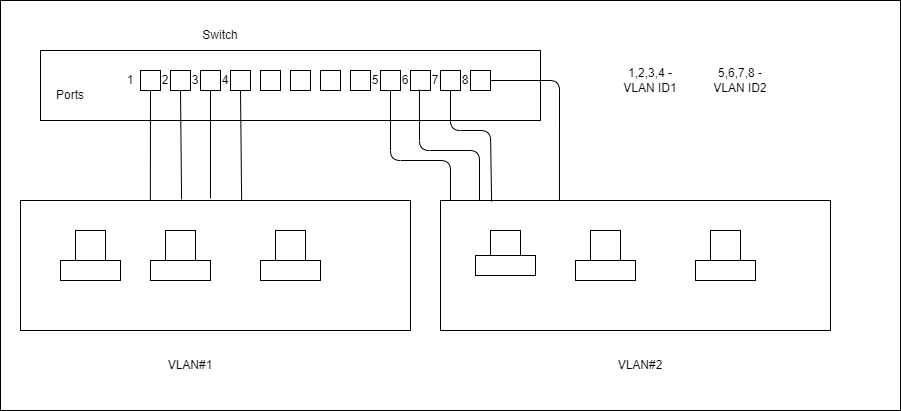

## DHCP
- 4 Step DORA process
  - **D**iscover (Find dhcp serve rin network)
  - **O**ffer (DHCP offers IP & lease)
  - **R**equest (Accept the info sent by DHCP)
  - **A**cknowledge (DHCP stores the recoed and sends ACK)

## DNS
- Fully qualified domain name (FQDN)  
  Ex: samplename.us.orgname.com  
  Here samplename - hostname,  us.orgname.com - root domain
  com - top level domain, orgname, us - subdomains
- We look from right-to-left in FQDN to complete DNS lookup
- Few Record Types:
  - A (DomainName - IPv4)
  - AAAA (DomainName - IPv6)
  - CNAME (Alias to DomainName)

## VLAN
- Convert physical LAN to multiple virtual LAN's
- Done by assigning specific ports on switch to one logical LAN
- These logical LAN's & ports on switches are assigned a **VLAN ID** which is used for inter VLAN communication
- Devices on different VLAN's can't communicate unless explicit setup is done
- Helps segment physical LAN by roles (Ex: HR, Accounting etc)

**VLAN with multiple switches**:
- Let's say we have 2 computers belonging to same VLAN but connected to different switches
- Then we can configure both switches with a **trunk port** to establish communication
- When the compuetr on one switch wants to communicate with the other conneected to different switch, it has to tag the frame with VLANID
- This VLAN ID is used by trunk port to forward it to the right switch and that switch uses this ID to forward the frame to right port
- Untagged frames can be configured to be sent to native VLAN which is done on trunk port

  